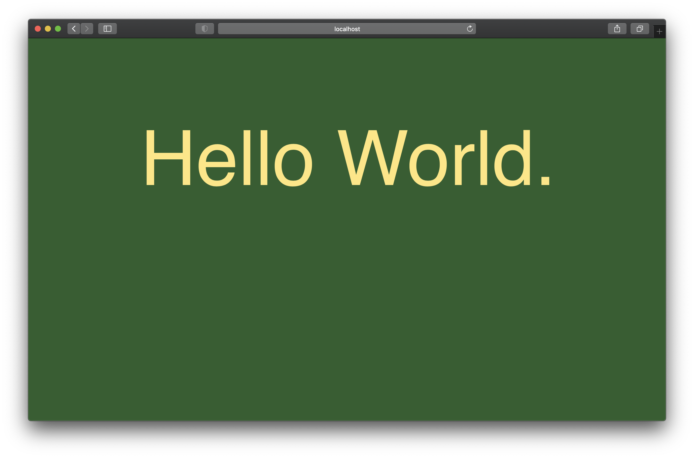

# Hello World

[](https://hub.docker.com/r/theknarf/hello-world)
[](https://github.com/TheKnarf/hello-world)

`Hello World` is a Docker container for showing a `Hello World` webpage, its useful for debugging.



## Docker compose setup

Add the following to your ´docker-compose.yml`:

```
version: "3.8"
services:
  helloworld:
    image: theknarf/hello-world
    restart: unless-stopped
    environment:
      - title=Hello two.
      - bgcolor=#4B3F72
      - textcolor=#EEE5E9
```

You can change some properties like colors and text using enviroment variables.

Enviroment variable|Default value|Description
-------------------|-------------|-----------
title | Hello World. | Title for the page
bgcolor | #2C5F2DFF | Background color
textcolor | #FFE77AFF | Text color
fontFamily | sans-serif | Font Family
fontSize | 20vh | Font Size
top | 20vh | Title top property
marginLeft | 17vw | Title margin-left property
googleFontFamily  | | Google font name
googleFontDisplay | | Google font display type
